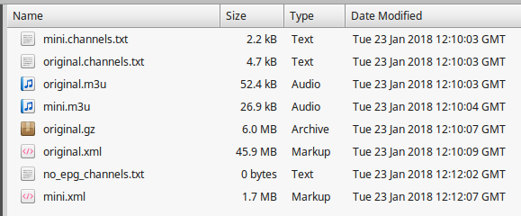

# m3u-epg-editor
An m3u / epg file optimizer script written in python

m3u-epg-editor enables download of m3u / epg files from a remote web server and introduces features to trim / optimize these files to a set of wanted channel groups along with the ability to sort / reorder channels

These features can prove useful where:

1. You have an underpowered device where SPMC / KODI / some other app running on that device is struggling to download and process very large m3u / epg files
2. Your service provider supplies you with a url that returns an m3u file containing both live TV channels and VOD content in that one file and you want to filter it to contain only live TV channels
3. You just want to achieve a filtered list and an improved custom sort order of TV channels

This script has been tested with the following IPTV providers:

1. **VaderStreams**
2. **FabIPTV**
3. **NecroIPTV**

VaderStreams ~~do~~ did support a unique feature to enable filtering groups within their m3u in the HTTP GET request/response via a `filterCategory` query string parameter. However there are some issues that are common to all IPTV service providers where there is no obvious, easy or free solution:

1. There is no method to remove specific channels within categories / groups
2. There is no method to re-order / sort channels within categories / groups to achieve a desired custom sort order
3. There is no method to reduce the volume of data within the epg to include only those channels that are required
4. There is no method to reduce the time window of data within the epg

There are commercially available online services that can solve these problems for a monthly / yearly subscription free.

m3u-epg-editor solves these problems for free on your own network / computer(s).

***

#### dependencies:
`python`

* m3u-epg-editor-py2.py is / was intended for use with Python v2.7. Official support for Python v2.7 ended on 01/01/2020, ref: [https://github.com/python/devguide/pull/344](https://github.com/python/devguide/pull/344) and [https://www.python.org/dev/peps/pep-0373/](https://www.python.org/dev/peps/pep-0373/). m3u-epg-editor-py2.py is no longer being maintained in this repo, please do not request any further maintenance changes to m3u-epg-editor-py2.py.
* m3u-epg-editor-py3.py is intended for use with Python v3.x. m3u-epg-editor-py3.py is currently being maintained.

Python installers can be downloaded from the official python website: [https://www.python.org/downloads/](https://www.python.org/downloads/).
In linux, Python can also be installed from a package repository with a package manager i.e. `apt`, `yum` etc or a software manager i.e. synaptic

#### python modules used by this script:
```
import sys
import os
import argparse
import json
import ast
import requests
import io
import re
import shutil
import gzip
from xml.etree.cElementTree import Element, SubElement, parse, ElementTree
import datetime
import dateutil.parser
import tzlocal
from urllib.request import url2pathname
from traceback import format_exception
```

#### installing required modules:
The majority of the modules mentioned above will be installed and available by default because they are a core part of Python

Python modules that are not included as part of a Python installation that do need to be installed are:

* `requests`
* `python-dateutil`
* `tzlocal`

i.e `pip install requests python-dateutil tzlocal`
***

#### command line options:
```
$ python ./m3u-epg-editor-py3.py --help
usage: m3u-epg-editor-py3.py [-h] [--json_cfg [JSON_CFG]] [--m3uurl [M3UURL]] [--epgurl [EPGURL]] [--groups [GROUPS]] [--groupmode [GROUPMODE]] [--discard_channels [DISCARD_CHANNELS]]
                             [--include_channels [INCLUDE_CHANNELS]] [--range [RANGE]] [--sortchannels [SORTCHANNELS]] [--xml_sort_type [XML_SORT_TYPE]] [--tvh_start [TVH_START]]
                             [--tvh_offset [TVH_OFFSET]] [--no_tvg_id] [--no_epg] [--force_epg] [--no_sort] [--http_for_images] [--preserve_case] [--outdirectory [OUTDIRECTORY]]
                             [--outfilename [OUTFILENAME]] [--log_enabled]

download and optimize m3u/epg files retrieved from a remote web server

optional arguments:
  -h, --help            show this help message and exit
  --json_cfg [JSON_CFG], -j [JSON_CFG]
                        A json input configuration file containing argument values. (default: None)
  --m3uurl [M3UURL], -m [M3UURL]
                        The url to pull the m3u file from. Both http:// and file:// protocols are supported. (default: None)
  --epgurl [EPGURL], -e [EPGURL]
                        The url to pull the epg file from. Both http:// and file:// protocols are supported. (default: None)
  --groups [GROUPS], -g [GROUPS]
                        Channel groups in the m3u to keep or discard. The default mode is to keep the specified groups, switch to discard mode with the -gm / --groupmode argument (default: None)
  --groupmode [GROUPMODE], -gm [GROUPMODE]
                        Specify "keep" or "discard" to control how the -g / --group argument should work. When not specified, the -g / --group argument behaviour will default to keeping the
                        specified groups (default: keep)
  --discard_channels [DISCARD_CHANNELS], -dc [DISCARD_CHANNELS]
                        Channels in the m3u to discard. Regex pattern matching is supported (default: None)
  --include_channels [INCLUDE_CHANNELS], -ic [INCLUDE_CHANNELS]
                        Channels in the m3u to keep. Regex pattern matching is supported. Channel matched in this argument will always be kept, effectively overriding of any other group or
                        channel exclusion configuration. (default: None)
  --range [RANGE], -r [RANGE]
                        An optional range window to consider when adding programmes to the epg (default: None)
  --sortchannels [SORTCHANNELS], -s [SORTCHANNELS]
                        The optional desired sort order for channels in the generated m3u (default: None)
  --xml_sort_type [XML_SORT_TYPE], -xs [XML_SORT_TYPE]
                        Specify "alpha" or "m3u" to control how channel elements within the resulting EPG xml will be sorted. When not specified channel element sort order will follow the
                        original source xml sort order (default: none)
  --tvh_start [TVH_START], -ts [TVH_START]
                        Optionally specify a start value to initialise the absolute start of numbering for tvh-chnum attribute values (default: None)
  --tvh_offset [TVH_OFFSET], -t [TVH_OFFSET]
                        An optional offset value applied to the Tvheadend tvh-chnum attribute within each channel group (default: None)
  --no_tvg_id, -nt      Optionally allow channels with no tvg-id attribute to be considered as valid channels (default: False)
  --no_epg, -ne         Optionally prevent the download of and the creation of any EPG xml data (default: False)
  --force_epg, -fe      Works in tandem with no_tvg_id and no_epg. When EPG processing is enabled and when this option is specified as true, the generated EPG file will be populated with elements
                        for channels in the m3u file that normally would have no EPG data (default: False)
  --no_sort, -ns        Optionally disable all channel sorting functionality (default: False)
  --http_for_images, -hi
                        Optionally prevent image attributes being populated where the source contains anything other than a http url i.e. data:image uri content (default: False)
  --preserve_case, -pc  Optionally preserve the original case sensitivity of tvg-id and channel attributes as supplied in the original M3U and EPG file data through to the target newly generated
                        M3U and EPG files (default: False)
  --outdirectory [OUTDIRECTORY], -d [OUTDIRECTORY]
                        The output folder where retrieved and generated file are to be stored (default: None)
  --outfilename [OUTFILENAME], -f [OUTFILENAME]
                        The output filename for the generated files (default: None)
  --log_enabled, -l     Optionally log script output to process.log (default: False)
```

#### Supplying arguments via a JSON configuration file:
All runtime arguments can be supplied via the file described by the `--json_cfg / -j` path. There is a sample JSON configuration file [here](./sample_input_args.json). When arguments are supplied via a JSON configuration file in the `--json_cfg / -j` argument, all arguments are expected to passed in that JSON configuration file and any arguments that are passed via the cli will be ignored. In other words, use `--json_cfg / -j` for all arguments or pass all individual arguments via the cli but do not attempt to use both.

#### sample usage calls (urls intentionally incomplete):
**VaderStreams:**
```
$ python ./m3u-epg-editor-py3.py -m="http://xxx.xxx.xxx/vget?username=<USERNAME>&password=<PASSWORD>&format=ts" -e="http://xxx.xxx/p2.xml.gz" -g="'sports','premium movies'" -c="'willow hd','bein sports espanol hd'" -s="'sky cinema drama hd','sky cinema comedy hd','sky cinema villians hd','sky cinema premiere hd','sky cinema sci-fi & horror hd','sky cinema thriller hd','sky cinema select hd','sky cinema family hd','sky cinema disney hd'" -r=12 -d="/home/target_directory" -f="output_file"
```
**FabIPTV:**
```
$ python ./m3u-epg-editor-py3.py -m="http://xxx.xxx:8080/get.php?username=<USERNAME>&password=<PASSWORD>&type=m3u_plus&output=ts" -e="http://xxx.xxx:8080/xmltv.php?username=<USERNAME>&password=<PASSWORD>" -g="'uk + 1 channels','uk bt sport','uk documentaries','uk entertainment','uk movies','uk other sports','uk sky sports'" -c="'dave hd'" -s="'bbc one +1','bbc two +1','itv +1','itv 2 +1','itv 3 +1','itv encore +1','itv4 +1','itvbe +1','channel 4 +1','channel 5 +1','sky living +1','sky1 +1'" -r=12 -d="/home/target_directory" -f="output_file"
```
***

#### files created by this script:



Each time this script is run, the following files will be created / overwritten in the specified `--outdirectory / -d` path:

* **original.m3u**

   This is the original unmodified m3u file downloaded from the specified `--m3uurl / -m` remote server
   
* **original.channels.txt**

   This is a raw text file log that contains an unfiltered list of all channel names from the original m3u
   
* **original.gz**

   This is the original unmodified epg gzip file downloaded from the specified `--epgurl / -e` remote server. No EPG processing is performed when the optional `--no_epg / -ne` argument is supplied.
   
* **original.xml**

   This is the original unmodified epg xml file extracted from the original epg gzip file. No EPG processing is performed when the optional `--no_epg / -ne` argument is supplied.
   
* **[--outfilename].m3u**

   This is the new rewritten m3u file created from the original m3u file. This will contain all of the channels that you've decided to keep. Channels are optionally sorted according to the sort order specified in `--sortchannels / -s`. If `--no_sort / -ns` is specified, anything supplied in `--sortchannels / -s` is ignored.
   
* **[--outfilename].channels.txt**

   This is basically a raw text file log containing the list of channel names from the original m3u that you've decided to keep. This can be useful for constructing a desired `--sortchannels / -s` sort order.
   
* **[--outfilename].xml**

   This is the new rewritten epg file created from the original epg file that contains epg data for all of the channels that you've decided to keep. If `--range / -r` was specified, epg data will be filtered to only include entries that fall within the range window of `range_start <= programme_start <= range_end`. No EPG file will be created when the optional `--no_epg / -ne` argument is supplied.
   
* **no_epg_channels.txt**

   This is a log of any channels that you decided to keep that were subsequently found to have no epg data available. This can be useful to help to construct a list of `--channels / -c` channels to exclude if i.e. you only want to keep those channels where epg data is available
